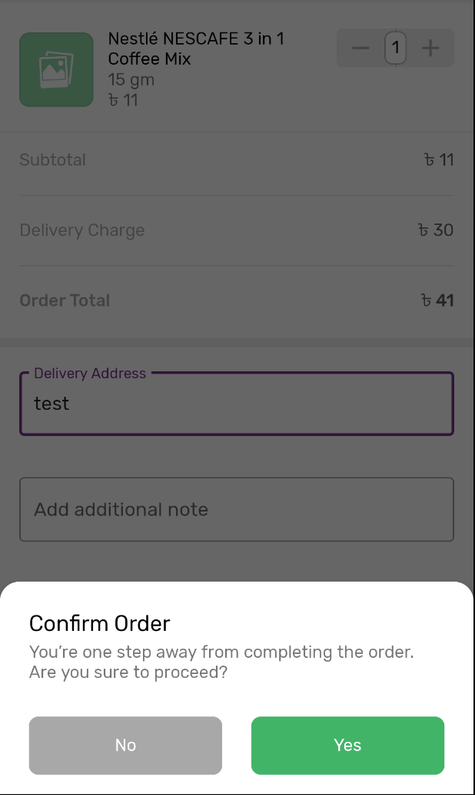
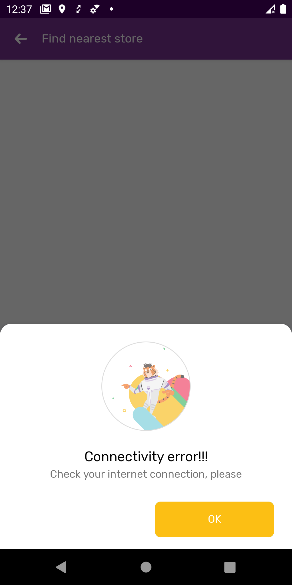

# bottom-dialog
Bottom Sheet Dialog acts as an Alert dialog. 
Features: 
- add Custom view 
- able to change custom default Title, subTItle 
- show/off imo rating bar 
- on/off negative button 
- change color of positive/negative button 
- change name of positive/negative button 
- individual call back for each button

# Add Dependency:
      dependencies {
            implementation 'com.github.glm-mawla:bottom-Action-Dialog:#version'
	}

Screen shots: 




# how to call
Call as like BottomSheetDialogFragment i.e
            
KOTLIN:

```
BottomActionDialog.DialogBuilder()
                .setTitle("Change your email")
                .setSubTitle("bla bla bla")
                .setIsShowBanner(false)
                .setCancelable(false)
                .setPositiveButton(R.string.set_pin,
                        object : BottomActionViewBottom.BottomDialogPositiveClickListener {
                            override fun onPositiveButtonClick(dialog: Dialog?) {
                                    dialog?.dismiss()
                                    //TODO()
                            }
                        },
                        R.color.green)
                .setNegativeButton(R.string.cancel, 
                        object : BottomActionViewBottom.BottomDialogNegativeClickListener {
                             override fun onNegativeButtonClick(dialog: Dialog?) {
                                    dialog?.dismiss()
                             }
                        },
                        R.color.gray_lite)
                .build(this)
                .showAsBottomSheet()
                
                
```

- Customisable positive & negative button: 
       
```
            .setPositiveButton(R.string.set_pin,
                        object : BottomActionViewBottom.BottomDialogPositiveClickListener {
                            override fun onPositiveButtonClick(dialog: Dialog?) {
                                    dialog?.dismiss()
                            }
                        },
                        R.color.green
                        )
                .setNegativeButton(R.string.cancel, 
                        object : BottomActionViewBottom.BottomDialogNegativeClickListener {
                            override fun onNegativeButtonClick(dialog: Dialog?) {
                                    dialog?.dismiss()
                            }
                        },
                        R.color.gray_lite
                        )
```

- On/OFF cancelable: 
``` 
            .setCancelable(true/false)
            
```
       
- others functions: 
 
        .setTitle()

        .setSubTitle(@StringRes)

        .setTitle(String?)

        .setSubTitle(String?)

        .setIsShowBanner(Boolean)

        .setRatingBar(listener: BottomActionViewBottom.BottomDialogRateSelectionListener)

        .hidePositiveButton() 

        .setCircularBanner(link: String?)

- Add custom View: 

        .addCustomView(view: View)
        
        
